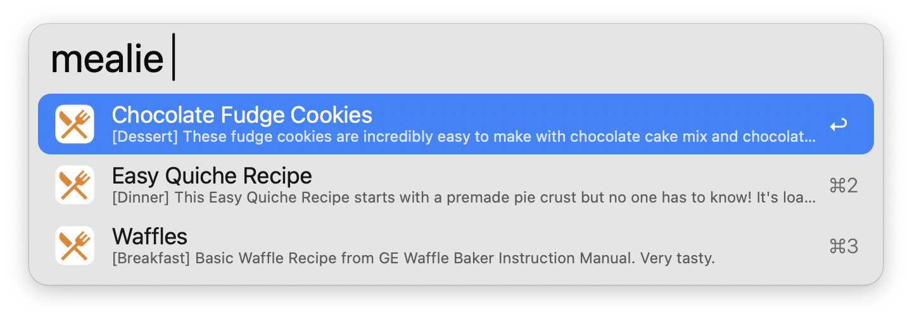
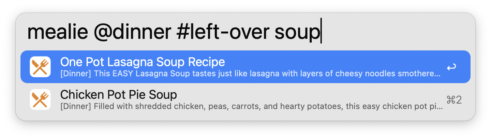
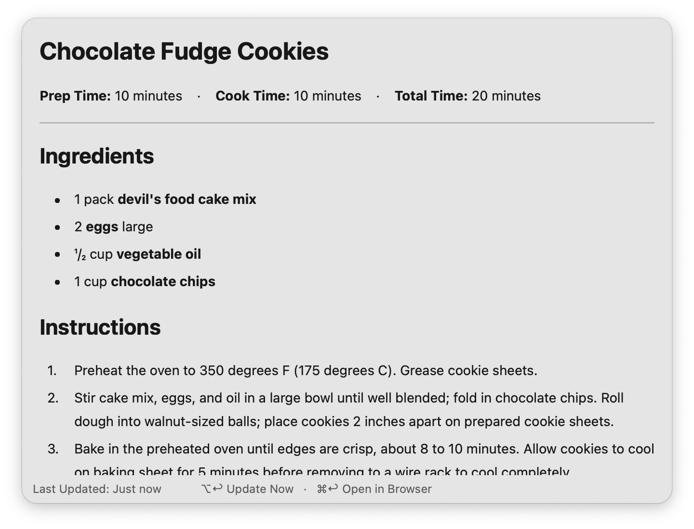
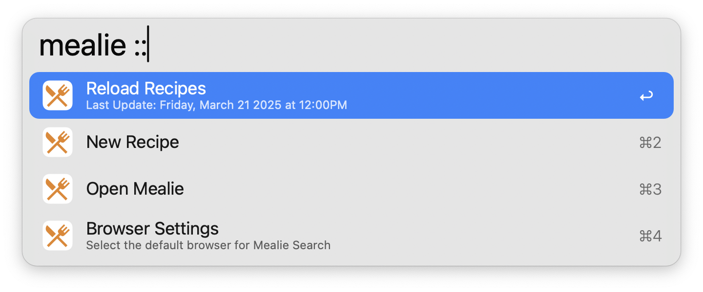
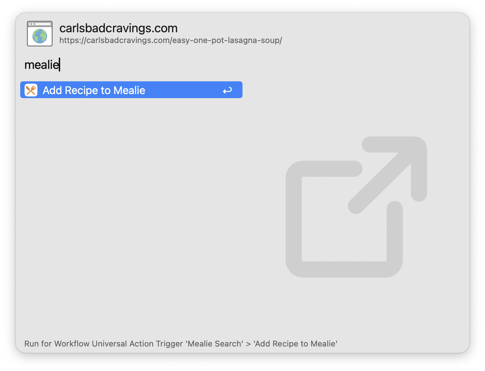

#  Mealie Search

Search & View Mealie Recipes in Alfred

[⤓ Install from the Alfred Gallery](https://alfred.app/workflows/firefingers21/mealie-search/)

## Setup

Set the Base URL and API Token of your [Mealie](https://github.com/mealie-recipes/mealie/) installation in the [Workflow’s Configuration](https://www.alfredapp.com/help/workflows/user-configuration/). You can generate an API Token from your Mealie user profile under API Tokens.

**Note**: This workflow requires [jq](https://jqlang.github.io/jq/) to function, which now comes preinstalled on macOS Sequoia 15.0.0 and later.

## Usage

Search for your [Mealie](https://mealie.io/) recipes using the `mealie` keyword.

Type to refine your search. Recipes are always filtered by title, while filtering by description, categories, tags, and tools are configurable from the [Workflow’s Configuration](https://www.alfredapp.com/help/workflows/user-configuration/).

* <kbd>↩</kbd> Open recipe in Alfred
* <kbd>⌘</kbd><kbd>↩</kbd> Open recipe in browser
* <kbd>⌃</kbd><kbd>↩</kbd> Delete recipe from Mealie

Recipes can be viewed directly within Alfred. This includes a list of Prep Times, Ingredients, Required Tools ([configurable](https://www.alfredapp.com/help/workflows/user-configuration/)), Step-by-Step Instructions, and Notes ([configurable](https://www.alfredapp.com/help/workflows/user-configuration/)).

* <kbd>⌘</kbd><kbd>↩</kbd> Open recipe in browser
* <kbd>⌥</kbd><kbd>↩</kbd> Refresh recipe data

Append `::` to the configured [Keyword](https://www.alfredapp.com/help/workflows/inputs/keyword) to access other actions, including manually reloading the recipes cache.

Recipe auto-updating is supported. The main recipe list auto-updates based on the slider in the [Workflow's Configuration](https://www.alfredapp.com/help/workflows/user-configuration/), while individual recipes refresh automatically based on data from the main recipe list.

Configure the [Hotkey](https://www.alfredapp.com/help/workflows/triggers/hotkey/) as a shortcut to search for your recipes. Use the [Universal Action](https://www.alfredapp.com/help/features/universal-actions/) to add URLs to Mealie from selected text or Alfred’s [Clipboard History](https://www.alfredapp.com/help/features/clipboard/).

